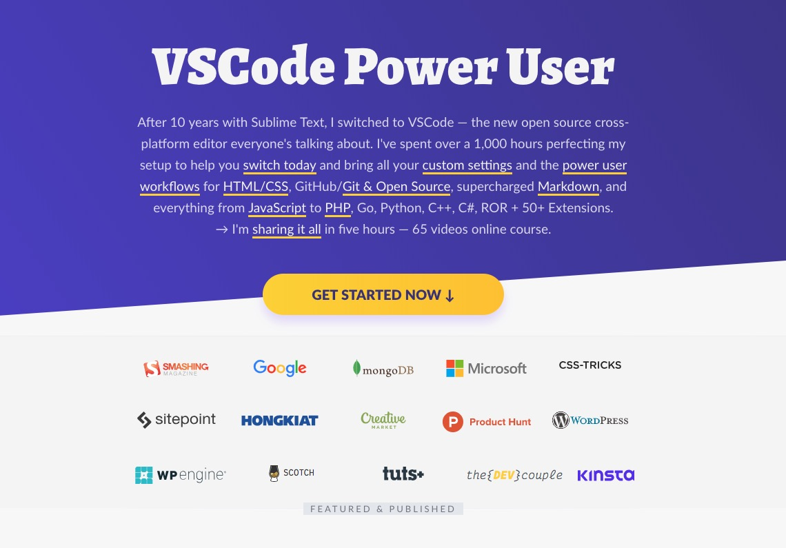

   
  

<h1 align="center">VSCode Tips Tricks</h1>

VSCode Tips Tricks is the Examples and Workflows repository of Visual Studio Code Power User Course → <a href="https://VSCode.pro">https://VSCode.pro</a>

 
 
 
 

<h2 align="center"><a href="https://twitter.com/MrAhmadAwais/" target="_blank" rel="noopener noreferrer" class="A__Wrap-YZyot alypB">Ahmad Awais</a></h2>

 Full-time #OpenSourcerer  JavaScript Dev Advocate  Builds <a href="https://github.com/AhmadAwais" target="_blank" rel="noopener noreferrer" class="A__Wrap-YZyot alypB">professional Open Source Software</a> used by over 218,900 Developers (inc. engineers at Google, Microsoft, Intel, HP…)  Ridiculously hard-working Full Stack Web Dev ⓦ Regular WordPress Core Developer  TEDx Speaker  Cloud/DevOps Community Evangelist  Member of SmashingMagazine Experts Panel, <a href="https://AhmadAwais.com/" target="_blank" rel="noopener noreferrer" class="A__Wrap-YZyot alypB">Featured/published author</a> at CSS-Tricks, Tuts+, Scotch.io, TorqueMag, SitePoint… Funnier than your mom. Seriously funny! You should follow him on twitter <a href="https://twitter.com/MrAhmadAwais/" target="_blank" rel="noopener noreferrer" class="A__Wrap-YZyot alypB">@MrAhmadAwais →</a>

It's a known fact that Ahmad loves purple. Purple can be genius. So, he built a VSCode theme which is used by thousands of developers 150,000+ installs and 50+ developer swear by its awesomeness. Install this theme called —  <a href="https://marketplace.visualstudio.com/items?itemName=ahmadawais.shades-of-purple" target="_blank" rel="noopener noreferrer" class="A__Wrap-YZyot alypB">Shades of Purple →</a>

